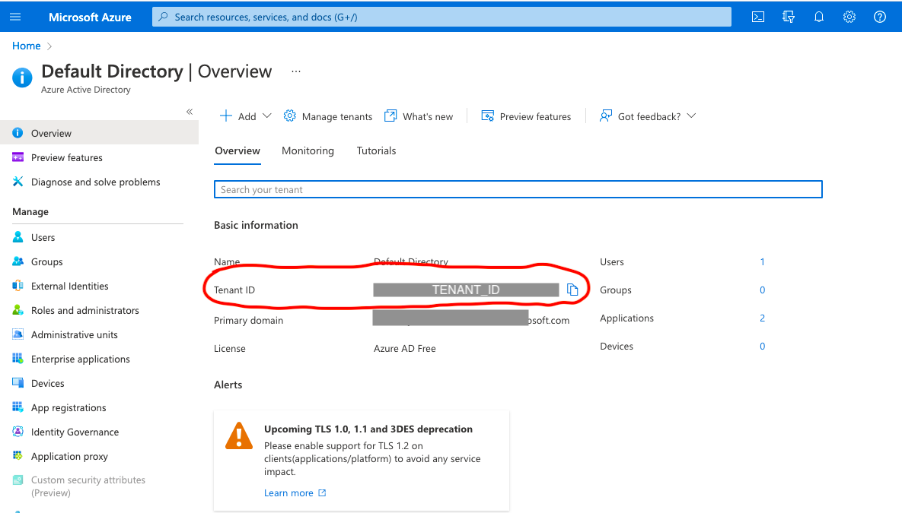
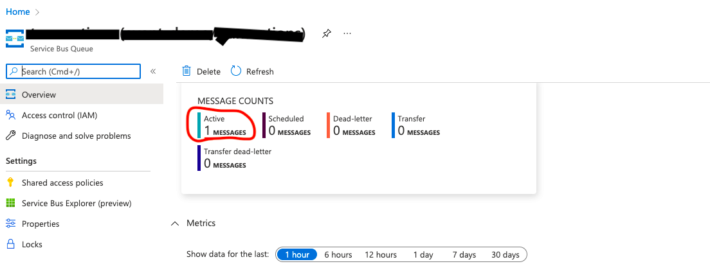

MICROSOFT IDENTITY PLATFORM AND DEVICE AUTHORIZATION FLOW TO USE AZURE SERVICE BUS

	

Microsoft Identity platform allows users to sign in to input-constrained devices. It leverages MASL for Java (MSAL4J) from an app that does not have the capability of offering an interactive authentication experience. The user visit a web page in their browser to login in. Once login success, the device will able to get access tokens and able to perform actions on the authorized Azure resources. This article demonstrates :  

Authentication 
Acquiring Access Token 
Publish message to Azure Service BUS using the access token

Before going to the code. We need to take care of the following prerequisites. 

<b>Application Registration :</b>

Login to Azure portal using your microsoft account. Click on the Active Directory Icon. Under manage section you can find "App registrations". 
Now click on the (+ New registration) 

    

In the register application screen provide the display name and select the supported account type as “Accounts in any organizational directory and personal Microsoft accounts”.

Now click on register . It will take few seconds to finish your app registration.

  

#####APP CLIENT ID :

Now go to  Azure Home —> Azure Active Directory —> App Registrations. Then under all applications you can find your application[ad-profile] created in the above step.  
<b>NOTE 01</b> -Copy the client ID from this screen and keep it for future use. This is required to configure in the code.

  

#####APP MANIFEST :

From the app registration screen , click on the manifest section and in the editor set the allowPublicClient <b>true</b>. 
Then click on save 

  

#####AUTHENTICATION : 

Now click on the authentication section of the App registration screen. Select “Mobile and desktop application” under “Configure platforms”

 
Now select the checkbox [https://login.microsoftonline.com/common/oauth2/nativeclient] and hit configure. 

 

  

#####API PERMISSION :

From the App’s registration screen go to the API permission section and add access to the Apis that our application needs.

 

In our case we need  Microsoft ServiceBus to publish message to the queue. 
Click on Microsoft.ServiceBus then select user_impersonation and then click on the “Add permission” button.

 

  

#####TENANT ID :

From Azure home click on “Azure Active Directory” icon. Then click on the overview tab.  
<b>NOTE 02</b> - Record the Tenant Id, which will be used further in the code. Refer the below screenshot.

      

<b>Creating service bus and Queue :</b>
 

To begin using service bus messaging entities in Azure, you must first create a namespace with a name that is unique across Azure
  

To create a namespace:  
1.Sign in to the Azure portal. 
2.In the left navigation pane of the portal, select <b>+ Create a resource</b>, select <b>Integration</b>, and then select <b>Service Bus</b>.


	
	

  

Select Review + create. The system now creates your namespace and enables it. 
You might have to wait several minutes as the system provisions resources for your account.

 

Select Go to resource on the deployment page.

 

You see the home page for your service bus namespace.  
<b>NOTE 03</b> - Record the Host name to use in the code. [refer the below screen shot to capture host name]

   

#####CREATING QUEUE IN THE PORTAL :

1. On the Service Bus Namespace page, select Queues in the left navigation menu. 
2. On the Queues page, select + Queue on the tool bar. 
3. Enter a name for the queue, and leave the other values with their defaults. 
4. <b>NOTE 04</b> - Capture the queue name for future use
5. Now, select Create.

 

      

<h2 font-size:16pt;>RUNNING THE CODE</h1>
 

Clone this code base 
Open the application.properties file. Put the value of <b>CLIENT_ID</b> from <b>NOTE 01</b> and <b>TENAT_ID</b> from <b>NOTE 02</b> that we have captured in the above steps. 

The value of QUEUE_URI is the combination of Host name from <b>NOTE 01</b> and the queue name that you have given [refer NOTE 04]  
if your namesapce id  "abc" and queue name is xyz, then  
Host name will be : <b>https://abc.servicebus.windows.net</b> 
QUEUE_URI will be : <b>https://event-demo.servicebus.windows.net/transactions/messages</b>

Now go to the root of the project and run the below command. 

$mvn clean package spring-boot:repackage
 

A jar file named azure-identity-servicebus-1.0.jar will be generated in the target folder. Now run the below command 

$ java -jar target/azure-identity-servicebus-1.0.jar
 

The above command will give the response like below: 

INFO com.ski.identity.servicebus.ServiceBusManager - To sign in, use a web browser to open the page https://microsoft.com/devicelogin and enter the code CGTEMEDQH to authenticate.

Now use the url(https://microsoft.com/devicelogin) and the code from the above response on a browser. It will ask for the user authentication.
This user must present in the active directory and have the permission to use ServiceBus.
Once after successful authentication, device will able to retrieve access token and publish message. 

From the portal, verify the message count in the queue . Refer the following screen shot

 

## References :

Find the below reference links for more information :
- [Service Bus authentication and authorization](https://docs.microsoft.com/en-us/azure/service-bus-messaging/service-bus-authentication-and-authorization) 
- [MSAL4J documentation](https://docs.microsoft.com/en-us/azure/active-directory/develop/migrate-adal-msal-java).
- [Microsoft identity platform, Azure Active Directory](https://docs.microsoft.com/azure/active-directory/develop/)
- [Microsoft identity platform and the OAuth 2.0 device authorization grant flow](https://docs.microsoft.com/en-us/azure/active-directory/develop/v2-oauth2-device-code)
- [Application registration with Microsoft identity platform](https://docs.microsoft.com/azure/active-directory/develop/quickstart-register-app)

